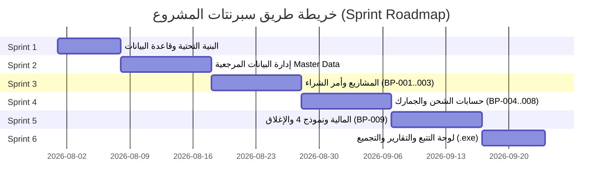

# Import Management System - Project Implementation Plan & Sprint Roadmap

خطة العمل الشاملة وتوزيع السبرنتات (Sprints) والمهام التفصيلية لبناء تطبيق سطح المكتب بلغة Python لنظام إدارة دورة الاستيراد بالكامل (Import Management System) استناداً إلى وثائق الـ BRD ومخطط PostgreSQL السايق إعدادهما.

---

## 🏗️ المعمارية التقنية والتصميم (Architectural Overview)

يعتمد التطبيق على معمارية الطبقات المستقلة (Layered Clean Architecture):
- **UI Layer (`PySide6`)**: واجهة سطح مكتب حديثة تدعم اللغة العربية والإنجليزية، وتعتمد على التبويبات والرسوم البيانية والجداول التفاعلية.
- **Service / Business Logic Layer (`Pydantic` & Services)**: تنفيذ قوانين الاستيراد وحسابات CBM والجمارك والسداد التراكمي وتتبع التعديلات.
- **Data Access Layer (`SQLAlchemy 2.0` Repositories)**: الاستعلامات السريعة وإدارة معاملات الجلسات وتنفيذ الـ Soft Delete والـ Audit Log.
- **Database Layer (`PostgreSQL 15+`)**: تخزين البيانات المرجعية والمعاملات المالية والتشغيلية وفقاً لـ `docs/schema.sql`.

---

## 🏃‍♂️ جدول السبرنتات (Sprint Roadmap & Tasks)

تم تقسيم المشروع إلى **6 سبرنتات متكاملة** لضمان تسليم تدريجي واختبار كل مرحلة بدقة.



---

### 🔹 Sprint 1: البنية التحتية، الاتصال بقاعدة البيانات، ونظام التعديلات (Infrastructure & Core Base)
**الهدف**: إعداد الاتصال بقاعدة البيانات PostgreSQL، بناء الـ ORM Models، وإعداد نظام التسجيل والتتبع (GP-004 Audit Trail).

- [ ] **Task 1.1**: إعداد `SQLAlchemy` Database Engine و Session Factory وتفعيل الاتصال المحمي (`src/database/session.py`).
- [ ] **Task 1.2**: بناء نماذج قاعدة البيانات (SQLAlchemy Models) للجداول الأساسية (`companies`, `suppliers`, `service_providers`, `currencies`, `incoterms`, `hs_codes`, `audit_log`).
- [ ] **Task 1.3**: إنشاء موديول `AuditService` لتسجيل جميع العمليات تلقائياً (Create, Update, Status Change, Soft Delete) وفقاً للقواعد GP-003 و GP-004.
- [ ] **Task 1.4**: إعداد الثيم العام للواجهة (`PySide6 QSS Stylesheet`) بدعم التصميم العصري الداكن والمضيء.
- [ ] **Task 1.5**: كتابة اختبارات الوحدات (Unit Tests) للتأكد من نجاح الاتصال وتطبيق الـ Audit Log.

---

### 🔹 Sprint 2: جداول البيانات المرجعية (Master Data Module - MD-001 to MD-008)
**الهدف**: إتاحة شاشات واجهة المستخدم لإدخال وتعديل وإدارة كافة البيانات المرجعية للنظام مع تطبيق التحقق من الصحة.

- [ ] **Task 2.1 - MD-001 Companies**:
  - شاشة إضافة/تعديل/عرض الشركات المصرية المستوردة.
  - حساب عدد الأيام المتبقية لانتهاء المستندات ديناميكياً وإظهار التنبيهات.
- [ ] **Task 2.2 - MD-002 Suppliers**:
  - شاشة الموردين الأجانب (Foreign Exporters).
  - التحقق المزدوج من عدم تكرار `Registration Type` و `Foreign Exporter ID`.
- [ ] **Task 2.3 - MD-003 & MD-004 External Service Providers**:
  - شاشة إدارة شركاء الأعمال (Freight Forwarders, Customs Brokers, Banks, Inspection Companies...).
  - دعم الـ Credit Limit و الـ Payment Types (Cash / Credit).
- [ ] **Task 2.4 - MD-005, MD-006, MD-007 (Shipping Lines, Currencies, Incoterms)**:
  - شاشة إدخال الخطوط الملاحية والرموز (SCAC Code).
  - شاشة العملات وأسعار الصرف وتحديد الخانات العشرية.
  - شاشة Incoterms المرنة، وربط البنود (`Cost Items`) وتحديد المسئوليات (`Importer`, `Exporter`, `Shared`).
- [ ] **Task 2.5 - MD-008 Projects**:
  - شاشة ربط المشروع بالشركة والمورد والـ Incoterm ونوع الاستيراد والأولوية.

---

### 🔹 Sprint 3: إدارة المعاملات الأولى وملفات الاستيراد (Pre-Shipment & Invoicing - BP-001 to BP-003)
**الهدف**: تمكين المستخدم من إنشاء Import File وإدخال أمر الشراء ومراجعة الفاتورة المبدئية والـ Packing List.

- [ ] **Task 3.1 - GP-001 Progressive Data Entry**:
  - السماح بحفظ الملف والـ Packing List بحقول غير مكتملة، وتطبيق التحقق حسب المرحلة الحالية (GP-002).
- [ ] **Task 3.2 - BP-001 Receive Purchase Order**:
  - شاشة إنشاء Import File وتحديد الـ Header Information وأصناف الشحنة (Shipment Items).
  - التحقق من تجميع إجمالي الفاتورة (`Amount = Qty × Unit Price`).
- [ ] **Task 3.3 - BP-002 Review Proforma Invoice**:
  - تجميع الأصناف تلقائياً حسب البند الجمركي `HS Code Summary`.
  - تقرير مراجعة الفاتورة والمطابقة.
- [ ] **Task 3.4 - BP-003 Review Packing List**:
  - إدخال الأوزان والأبعاد وتفاصيل الطرود.
  - التحقق من شرط `Gross Weight >= Net Weight` وتطابق الكميات مع الفاتورة.

---

### 🔹 Sprint 4: حسابات CBM، وسيلة الشحن، العروض، والجمارك (BP-004 to BP-008)
**الهدف**: حساب أحجام الشحنة، مقارنة عروض أسعار الشحن، مراجعة الاستشارات الجمركية وتقدير الرسوم الجمركية والضرائب.

- [ ] **Task 4.1 - BP-004 Calculate CBM & Chargeable Weight**:
  - تنفيذ خدمة الحسابات الرياضية:
    $$Ocean CBM = \frac{Qty \times L \times W \times H}{1,000,000}$$
    $$Air Chargeable Weight = \frac{Qty \times L \times W \times H}{6,000}$$
- [ ] **Task 4.2 - BP-005 & BP-006 Freight Quotations & Shipping Method**:
  - اختيار طريقة الشحن (Ocean FCL, LCL, Air, Road).
  - شاشة إدخال عروض الأسعار المقارنة واحتساب متوسط الـ ETA والترشيح الأفضل.
- [ ] **Task 4.3 - BP-007 Customs Consultation**:
  - شاشة الـ Customs Checklist وتتبع حالة كل مستند (`Received`, `Verified`, `Approved`).
- [ ] **Task 4.4 - BP-008 Estimate Duties**:
  - شاشة تقدير الرسوم والضرائب التقديرية لكل بند جمركي `HS Code`.
  - أخذ نسخة تاريخية (Snapshot) لنسب الضرائب والرسوم وقت التقدير.

---

### 🔹 Sprint 5: المعاملات المالية، الدفع، نموذج 4، وإستلام المخزن (BP-009, Form 4 & Closing)
**الهدف**: إصدار طلبات الدفع المالية للموردين وشركاء الخدمة، متابعة نموذج 4 والتحويلات البنكية وإغلاق ملف الاستيراد بالمخزن.

- [ ] **Task 5.1 - BP-009 Payment Request**:
  - شاشة إنشاء طلبات الدفع (Advance, Against BL, Final).
  - التحقق من عدم تجاوز إجمالي المدفوعات لقيمة الفاتورة المعتمدة.
  - تنبيه المستورد عند اختلاف بيانات بنك المورد المرفقة عن الـ Master Data.
- [ ] **Task 5.2 - Form 4 & SWIFT Management**:
  - تسجيل بيانات وإرفاق صورة الـ SWIFT وترقية حالة الطلب إلى `Paid`.
  - ربط مستندات نموذج 4 وتاريخ الاستلام.
- [ ] **Task 5.3 - Warehouse Receiving & Closing**:
  - شاشة استلام البضاعة بالمخزن ومطابقة كميات الإفراج الجمركي وتسجيل الفروقات إن وجدت.
  - إغلاق ملف الاستيراد وتحويل حالته إلى `Closed`.

---

### 🔹 Sprint 6: لوحة التتبع (Dashboard)، التقارير، والتجميع (.exe Packaging)
**الهدف**: تجهيز لوحة المؤشرات KPIs الرئيسية، إمكانية طباعة وتصدير التقارير، وتجميع التطبيق لملف تنفيذي جاهز للتثبيت.

- [ ] **Task 6.1 - Executive Dashboard**:
  - تصميم لوحة المتابعة الرئيسية وإظهار مؤشرات الشحنات النشطة، التدفقات النقدية (Cash Outflows)، والتنبيهات بالصلاحيات الجمركية.
- [ ] **Task 6.2 - Reporting & Data Export**:
  - تصدير الفواتير وطلبات السداد والتقارير بصيغة PDF عبر `ReportLab` وصيغة Excel عبر `OpenPyXL`.
- [ ] **Task 6.3 - Packaging with PyInstaller**:
  - بناء وتجميع التطبيق في ملف تنفيذي مستقل `ImportSystem.exe`.
- [ ] **Task 6.4 - Final Verification & Testing**:
  - إجراء اختبار شامل (E2E Integration Testing) لكل مراحل دورة العمل.

---

## 🔍 التقييم والمراجعة الدقيقة (Plan Review & Self-Audit)

تمت مراجعة الخطة للتأكد من تغطيتها لكافة المتطلبات:

1. **الالتزام بالقواعد العامة (GP-001 to GP-004)**:
   - تم الالتزام الكامل بالإدخال التدريجي وعدم إجبار الحقول غير المطلوبة في المرحلة الأولى.
   - تم الالتزام بتسجيل كل عملية تعديل لحفظ الـ Audit Trail كاملاً بدون حذف بيانات.
2. **الالتزام بدقة البيانات المرجعية (MD-001 to MD-008)**:
   - مرونة Incoterms بالاعتماد على الجداول ثلاثية الأبعاد بدلاً من أعمدة Yes/No الثابتة.
   - التحقق من التفرد للشركات والموردين والبنود الجمركية.
3. **الدقة الحسابية والتنفيذية**:
   - مطابقة معادلات CBM والـ Chargeable Weight وحفظ نسب الضرائب بصيغة Snapshot تاريخية.

---

## 🧪 خطة التحقق والاختبار (Verification Plan)

### الاختبارات المؤتمتة (Automated Tests)
- تشغيل اختبارات `pytest` لاختبار معادلات CBM، حساب الضرائب، والتحقق من أرصدة طلبات الدفع:
  ```bash
  pytest tests/test_cbm_calculator.py
  pytest tests/test_duties_estimator.py
  pytest tests/test_payment_validation.py
  ```

### التحقق اليدوي (Manual Verification)
- تشغيل الواجهة الرسومية عبر `python src/main.py` واختبار دورة كاملة لشحنة بدءاً من إدخال أمر الشراء وحتى الاستلام بالمخزن.
