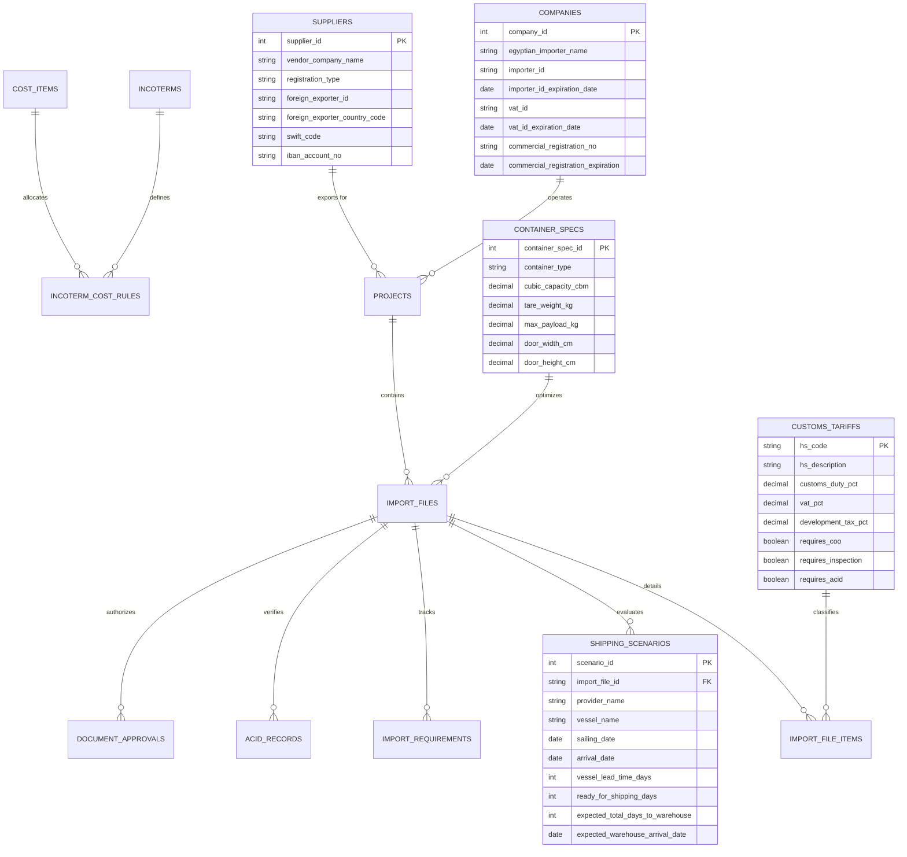

# Data Model Specification: Import Operations Management Platform

## 1. Entity Relationship Diagram (Mermaid Schema)

---

## 2. Table Specifications

### 2.1 `companies` (`MD-001`)
- `company_id`: `Integer` (PK, Autoincrement)
- `egyptian_importer_name`: `String(255)` (Nullable=False)
- `address`: `Text` (Nullable=False)
- `country`: `String(100)` (Nullable=False, Default="Egypt")
- `importer_id`: `String(64)` (Nullable=False)
- `importer_id_expiration_date`: `Date` (Nullable=False)
- `vat_id`: `String(64)` (Nullable=False)
- `vat_id_expiration_date`: `Date` (Nullable=False)
- `commercial_registration_no`: `String(64)` (Nullable=False)
- `commercial_registration_expiration`: `Date` (Nullable=False)
- `status`: `String(16)` (Default="active")

### 2.2 `suppliers` (`MD-002`)
- `supplier_id`: `Integer` (PK, Autoincrement)
- `vendor_company_name`: `String(255)` (Nullable=False)
- `registration_type`: `String(32)` (Nullable=False)
- `foreign_exporter_id`: `String(64)` (Nullable=False)
- `foreign_exporter_country`: `String(100)` (Nullable=False)
- `foreign_exporter_country_code`: `String(8)` (Nullable=False)
- `bank_name`: `String(255)` (Nullable=True)
- `swift_code`: `String(32)` (Nullable=True)
- `iban_account_no`: `String(128)` (Nullable=True)
- *Constraints*: `UniqueConstraint('registration_type', 'foreign_exporter_id')`

### 2.3 `customs_tariffs` (`MD-008`)
- `hs_code`: `String(20)` (PK)
- `hs_description`: `Text` (Nullable=False)
- `customs_duty_pct`: `Numeric(7, 4)` (Nullable=False, Default=0.0)
- `vat_pct`: `Numeric(7, 4)` (Nullable=False, Default=0.14)
- `development_tax_pct`: `Numeric(7, 4)` (Nullable=False, Default=0.0)
- `requires_coo`: `Boolean` (Default=True)
- `requires_inspection`: `Boolean` (Default=False)
- `requires_acid`: `Boolean` (Default=True)
- `regulatory_authority`: `String(64)` (Nullable=True)

### 2.4 `container_specs` (`MD-010`)
- `container_spec_id`: `Integer` (PK, Autoincrement)
- `container_type`: `String(16)` (Nullable=False, Unique=True)
- `internal_length_cm`: `Numeric(10, 2)` (Nullable=False)
- `internal_width_cm`: `Numeric(10, 2)` (Nullable=False)
- `internal_height_cm`: `Numeric(10, 2)` (Nullable=False)
- `door_width_cm`: `Numeric(10, 2)` (Nullable=False)
- `door_height_cm`: `Numeric(10, 2)` (Nullable=False)
- `cubic_capacity_cbm`: `Numeric(10, 4)` (Nullable=False)
- `tare_weight_kg`: `Numeric(10, 2)` (Nullable=False)
- `max_payload_kg`: `Numeric(10, 2)` (Nullable=False)

### 2.5 `shipping_scenarios` (`BP-007`)
- `scenario_id`: `Integer` (PK, Autoincrement)
- `import_file_id`: `String(32)` (FK to `import_files.import_file_id`)
- `provider_name`: `String(255)` (Nullable=False)
- `vessel_name`: `String(255)` (Nullable=False)
- `sailing_date`: `Date` (Nullable=False)
- `arrival_date`: `Date` (Nullable=False)
- `vessel_lead_time_days`: `Integer` (Nullable=False)
- `ready_for_shipping_days`: `Integer` (Nullable=False)
- `expected_line_delay_days`: `Integer` (Nullable=False, Default=2)
- `expected_total_days_to_warehouse`: `Integer` (Nullable=False)
- `expected_warehouse_arrival_date`: `Date` (Nullable=False)
- `is_recommended`: `Boolean` (Default=False)
